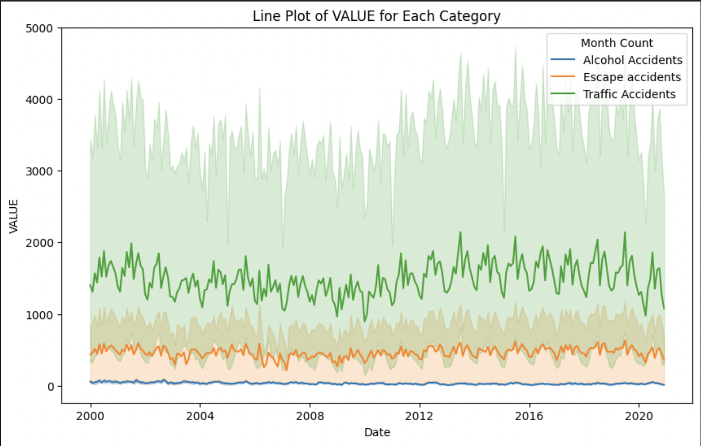
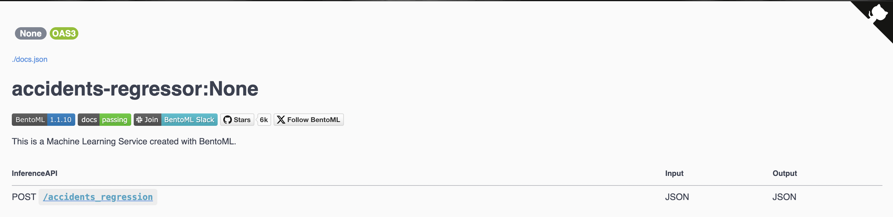
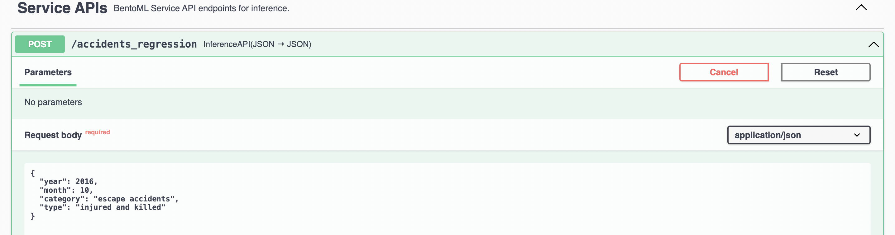
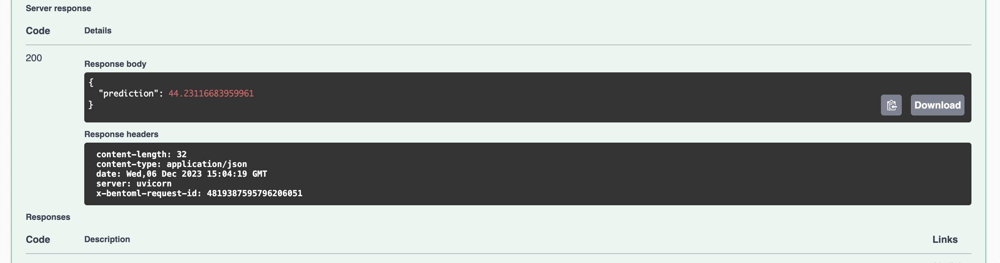

# Traffic-Accidents-Model

Welcome to the repository for the Digital Product School's AI Engineering Challenge round. This repository contains all the code related to the development and deployment of a traffic accidents prediction model.

## Deployment

The model has been deployed on Heroku using BentoML, and the Streamlit app is hosted on Streamlit Cloud.

- **Endpoint**: [Accidents App on Heroku](https://accidents-app-8b4af04b640b.herokuapp.com/) (Note: It might crash due to memory usage)
- **Streamlit Cloud**: [Streamlit Cloud](https://streamlit.io/cloud)

Additionally, the Docker image is available on Docker Hub at [dikshashrivastava13/accidents](https://hub.docker.com/repository/docker/dikshashrivastava13/accidents/general).

## Notebooks and Kaggle

The different models and their results can be found in the `ai-challenge-2.ipynb` notebook and the Visualisations page of the Streamlit app. The best performing model is the XGBoost Regressor with the following metrics:
- Root Mean Squared Error (RMSE): 179.2515
- R-squared (R2) Score: 0.9787

The models were trained on Kaggle Notebooks, and you can find the Jupyter Notebooks in the "Jupyter Notebooks" section.

- Kaggle | Visualization: [Kaggle Visualization Notebook](https://www.kaggle.com/code/dikshashri13702/ai-challenge-1/notebook)
- Kaggle | Modeling: [Kaggle Modeling Notebook](https://www.kaggle.com/code/dikshashri13702/ai-challenge-2/notebook)

## Directory Structure

```plaintext
- data
    - preprocessed_dataset (1).csv
    - translated_dataset.csv
- Frontend
    - .streamlit
    - models
    - visualisations
    - encoding.py
    - Home.py
    - model_handler.py
- Jupyter Notebooks
    - ai-challenge-1.ipynb
    - ai-challenge-2.ipynb
- Models
    - model_file_name.json
- bento_model_handler.py
- bentofile.yaml
- encoding.py
- service.py
```

## Historical Trend

Here is a plot depicting the historical trend of different categories of accidents:



## Models Explored

I experimented with various models to solve this problem:

1. Linear Regression Model
2. Poison Regression Model
3. MultiLayer Perceptron Regressor
4. XGBoost
5. LightGBM Model
6. KFold Validation on XGBoost
7. Prophet Models
8. ARIMA Model
9. XGBoost Modeling for Time Series
10. Prophet: More Experiments
11. SARIMAX Model
12. SKTime Model

Feel free to explore the models in the respective directories and notebooks.

Thank you for visiting the repository!



